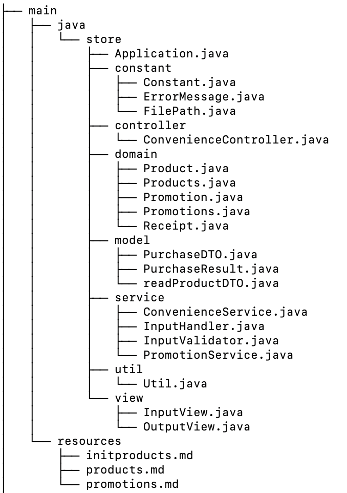
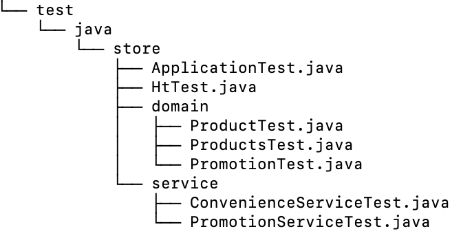

# 프리코스 4주차 - W편의점


> 프로모션이 적용된 상품 구매를 할 수 있는 간단한 편의점 서비스입니다.
--- 
> 패키지 구조
<p align="center">
    
</p>
<p align="center">
    
</p>

## 제약 조건
1. 상품명, 수량은 하이픈(-)으로, 개별 상품은 대괄호([])로 묶어 쉼표(,)로 구분
2. 상품명에 쉼표(,) 들어갈 수 없음
3. 동의는 Y
4. 거부는 N

## 기능 구현 목록
1. 재고 관리
- [x] 재고 수량을 고려해 결제 가능 여부 확인
- [x] 구매할 때마다 구매한 만큼 재고 차감
- [x] 다음 고객에게 정확한 재고 정보 제공

2. 프로모션 관리
- [x] 오늘 날짜가 프로모션 기간 내일 때만 할인 적용

3. 편의점 서비스
- [x] 프로모션 재고 내에서만 적용 가능, 프로모션 재고가 부족할 때 일반 재고 사용
- [x] 프로모션이 적용 가능해서 공짜로 받을지 말지 물어보기
- [x] 프로모션 재고가 부족하여 일부 수량을 프로모션 혜택 없이 살지 물어보기
- [x] 멤버십 할인
  - [x] 프로모션 미적용? 금액의 30% 할인
  - [x] 최대 한도 8,000원

4. 영수증 출력
- [x] 구매 상품 내역: 상품명, 수량, 가격
- [x] 증정 상품 내역: 프로모션에 따라 무료로 제공된 증정 상품의 목록
- [x] 금액 정보
  - [x] 총구매액: 구매한 상품의 총 수량과 총 금액
  - [x] 행사할인: 프로모션에 의해 할인된 금액
  - [x] 멤버십할인: 멤버십에 의해 추가로 할인된 금액
  - [x] 내실돈: 최종 결제 금액
- [x] 보기 좋게 출력한다

## 입출력
> 입력 :

1. [구매할상품이름1-갯수],[구매할상품이름2-갯수]
2. 프로모션 챙겨주기 (Y, N)
3. 프로모션 재고 부족할때 정가로 결제할지 유무 (Y, N)
4. 멤버십 유무 (Y, N)
5. 추가 구매 유무(Y, N)

> 예시
```
[콜라-10],[사이다-3]
```
```
Y
```
> 출력 :

1. 환영 인사
2. 상품 이름, 가격, 재고, 프로모션
3. 프로모션 챙겨주기
4. 프로모션 재고 부족할때 정가로 결제할지 물어보기
5. 멤버십 물어보기
6. 영수증
7. 한번더 구매할지 물어보기

> 예시
```
안녕하세요. W편의점입니다.
현재 보유하고 있는 상품입니다.

- 콜라 1,000원 10개 탄산2+1
- 콜라 1,000원 10개
- 사이다 1,000원 8개 탄산2+1
- 사이다 1,000원 7개
- 오렌지주스 1,800원 9개 MD추천상품
- 오렌지주스 1,800원 재고 없음
- 탄산수 1,200원 5개 탄산2+1
- 탄산수 1,200원 재고 없음
- 물 500원 10개
- 비타민워터 1,500원 6개
- 감자칩 1,500원 5개 반짝할인
- 감자칩 1,500원 5개
- 초코바 1,200원 5개 MD추천상품
- 초코바 1,200원 5개
- 에너지바 2,000원 5개
- 정식도시락 6,400원 8개
- 컵라면 1,700원 1개 MD추천상품
- 컵라면 1,700원 10개

구매하실 상품명과 수량을 입력해 주세요. (예: [사이다-2],[감자칩-1])
[콜라-3],[에너지바-5]

멤버십 할인을 받으시겠습니까? (Y/N)
Y 

===========W 편의점=============
상품명		수량	금액
콜라		3 	3,000
에너지바 		5 	10,000
===========증	정=============
콜라		1
==============================
총구매액		8	13,000
행사할인			-1,000
멤버십할인			-3,000
내실돈			 9,000

감사합니다. 구매하고 싶은 다른 상품이 있나요? (Y/N)
Y

안녕하세요. W편의점입니다.
현재 보유하고 있는 상품입니다.

- 콜라 1,000원 7개 탄산2+1
- 콜라 1,000원 10개
- 사이다 1,000원 8개 탄산2+1
- 사이다 1,000원 7개
- 오렌지주스 1,800원 9개 MD추천상품
- 오렌지주스 1,800원 재고 없음
- 탄산수 1,200원 5개 탄산2+1
- 탄산수 1,200원 재고 없음
- 물 500원 10개
- 비타민워터 1,500원 6개
- 감자칩 1,500원 5개 반짝할인
- 감자칩 1,500원 5개
- 초코바 1,200원 5개 MD추천상품
- 초코바 1,200원 5개
- 에너지바 2,000원 재고 없음
- 정식도시락 6,400원 8개
- 컵라면 1,700원 1개 MD추천상품
- 컵라면 1,700원 10개

구매하실 상품명과 수량을 입력해 주세요. (예: [사이다-2],[감자칩-1])
[콜라-10]

현재 콜라 4개는 프로모션 할인이 적용되지 않습니다. 그래도 구매하시겠습니까? (Y/N)
Y

멤버십 할인을 받으시겠습니까? (Y/N)
N

===========W 편의점=============
상품명		수량	금액
콜라		10 	10,000
===========증	정=============
콜라		2
==============================
총구매액		10	10,000
행사할인			-2,000
멤버십할인			-0
내실돈			 8,000

감사합니다. 구매하고 싶은 다른 상품이 있나요? (Y/N)
Y

안녕하세요. W편의점입니다.
현재 보유하고 있는 상품입니다.

- 콜라 1,000원 재고 없음 탄산2+1
- 콜라 1,000원 7개
- 사이다 1,000원 8개 탄산2+1
- 사이다 1,000원 7개
- 오렌지주스 1,800원 9개 MD추천상품
- 오렌지주스 1,800원 재고 없음
- 탄산수 1,200원 5개 탄산2+1
- 탄산수 1,200원 재고 없음
- 물 500원 10개
- 비타민워터 1,500원 6개
- 감자칩 1,500원 5개 반짝할인
- 감자칩 1,500원 5개
- 초코바 1,200원 5개 MD추천상품
- 초코바 1,200원 5개
- 에너지바 2,000원 재고 없음
- 정식도시락 6,400원 8개
- 컵라면 1,700원 1개 MD추천상품
- 컵라면 1,700원 10개

구매하실 상품명과 수량을 입력해 주세요. (예: [사이다-2],[감자칩-1])
[오렌지주스-1]

현재 오렌지주스은(는) 1개를 무료로 더 받을 수 있습니다. 추가하시겠습니까? (Y/N)
Y

멤버십 할인을 받으시겠습니까? (Y/N)
Y

===========W 편의점=============
상품명		수량	금액
오렌지주스		2 	3,600
===========증	정=============
오렌지주스		1
==============================
총구매액		2	3,600
행사할인			-1,800
멤버십할인			-0
내실돈			 1,800

감사합니다. 구매하고 싶은 다른 상품이 있나요? (Y/N)
N
```

